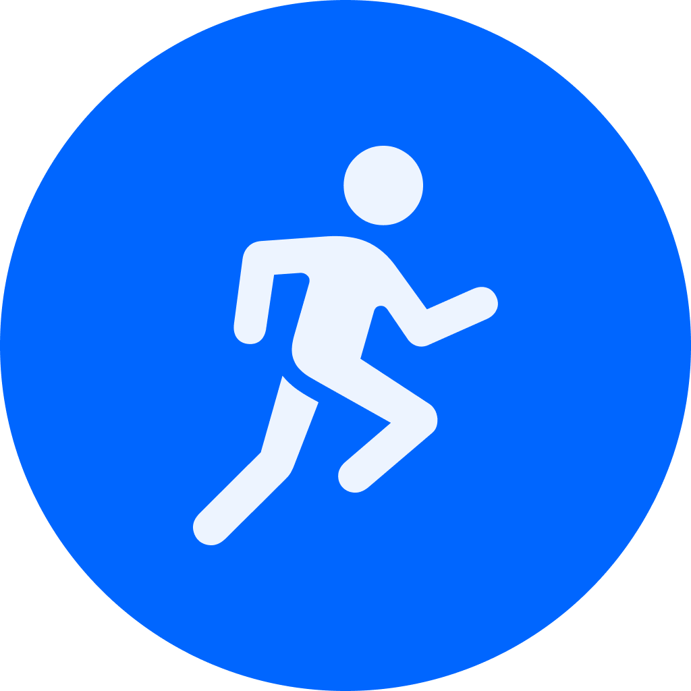

# client-side

 

  

 

> 'HotSOS 서비스'는 사용자의 위치와 친구들의 재난 상황을 실시간으로 확인할 수 있는 재난 알림 및 커뮤니티 플랫폼입니다.

 

## 목차

1. [개발 기간](#개발-기간)
2. [기술 스택](#기술-스택)
3. [프로젝트 소개](#프로젝트-소개)
4. [주요 기능](#주요-기능)
5. [아키텍쳐](#아키텍쳐)
6. [개발 팀 소개](#개발-팀-소개)

 

## 1. 개발 기간

### 2024/07/08(월) ~ 2024/08/16(금)

 

## 2. 기술 스택

### Frontend

 
  
  
  
  
  

### Backend

 
  
  
  
  
  
  
  
  

### Infra & DevOps

 
  
  
  
  

### Tools

 
  
  
  
  
  

 

## 3. 프로젝트 소개

 

## 4. 주요 기능

| 화면                  | 이미지                                                                                                   | 주요 기능                                                                                           |
| --------------------- | -------------------------------------------------------------------------------------------------------- | --------------------------------------------------------------------------------------------------- |
| 메인 홈               |  | - 위치 기반 현재 날씨 표시   - 친한 친구 재난 현황 확인   - 본인 및 친한 친구의 재난문자 확인 |
| 재난문자 상세         |  | - 재난문자의 상세 내용을 확인   - 친한 친구 필터링 적용                                          |
| 알림                  |  | - 재난 문자 알림                                 |
| 게시판(욕설 필터링)   |  | - 게시판 내 욕설 자동 필터링                                       |
| 게시판(핫게시물 알림) |  | - 인기 게시물 상단 배치 및 우선 확인   - 핫게시물 알림 기능 제공                                              |

 

## 5. 아키텍쳐

 

## 6. 개발 팀 소개

| 
[표다영](https://github.com/celestedayoung)
 | 
[황민욱](https://github.com/minukhwang)
 | 
[박성재](https://github.com/qkrtjdwo5662)
 | 
[고동현](https://github.com/DongHyun222)
 | 
[임가영](https://github.com/Limgayoung)
 | 
[김태수](https://github.com/kimtaesoo99)
 |
| :-------------------------------------------------------------------: | :---------------------------------------------------------------: | :-----------------------------------------------------------------: | :----------------------------------------------------------------: | :---------------------------------------------------------------: | :----------------------------------------------------------------: |
|                        **Frontend \| Design**                         |                      **Frontend \| Design**                       |                             **Backend**                             |                            **Backend**                             |                       **Backend \| Infra**                        |                        **Backend \| Infra**                        |

---